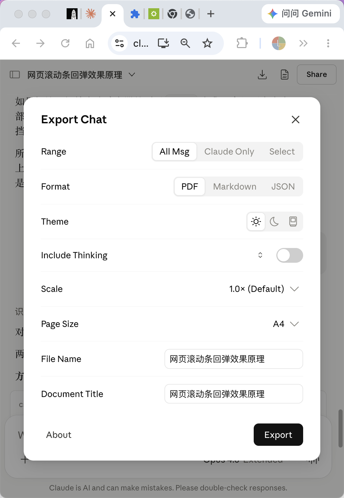
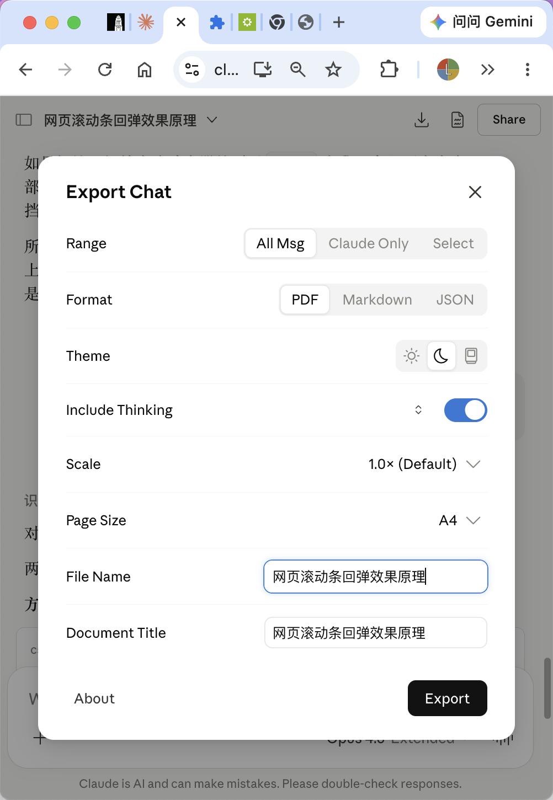
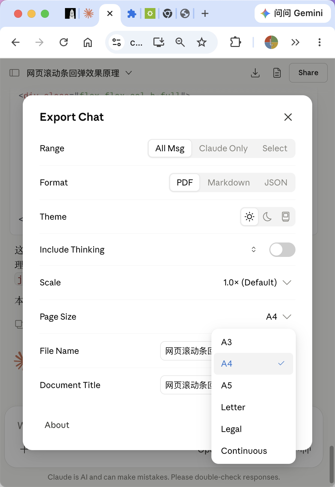
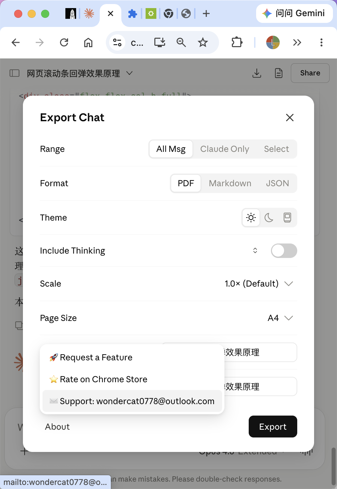

# Claude to PDF — UI Redesign Proposal

A UI redesign for the [Claude to PDF](https://chromewebstore.google.com/detail/claude-to-pdf/mneopldolfcfoefkmedgdclnabpjkegk) Chrome extension, aligning the export panel with Anthropic's native Design System (CDS).

## What Changed

The current extension UI uses custom-styled components that don't match Claude's native interface. This redesign replaces them with components built from Claude's actual CSS classes and design tokens.

### Screenshots

| Export Panel | Switch & Focus | Combobox Dropdown | About Menu |
|:---:|:---:|:---:|:---:|
|  |  |  |  |

### Controls Used

| Component | Source | Claude Class / Token |
|-----------|--------|---------------------|
| Segmented Control | Settings → Appearance | `bg-segment-track`, `bg-segment-thumb`, `data-[checked]:text-primary` |
| Switch / Toggle | Settings → Notifications | `bg-switch-track`, `data-[checked]:bg-fill-accent` (#2a78d6) |
| Text Input | Settings → Full name | `cds-input cds-reset h-control bg-fill-field shadow-field-ring` |
| Combobox | Settings → Chat font | `cds-reset inline-flex h-control ... hover:bg-fill-ghost-hover` |
| Ghost Button | Sidebar buttons | `_fill_10ocf_9 _ghost_10ocf_96` |
| Primary Button | Share dialog → "Create share link" | `_fill_10ocf_9 _primary_10ocf_44` |
| Icons | Anthropicons Variable font | `` (sun), `` (moon), `` (system), `` (chevron), `` (check), `` (expand), `` (collapse) |

### Panel Layout

All rows use the exact settings page pattern:

```
flex items-center justify-between gap-lg py-md
```

Wrapped in `cds-root text-primary` with `data-density="comfortable"` — same as the Settings page container.

| Row | Control Type |
|-----|-------------|
| Range | SegmentedControl: All Msg / Claude Only / Select |
| Format | SegmentedControl: PDF / Markdown / JSON |
| Theme | SegmentedControl (icon-only): ☀️ / 🌙 / 🖥 |
| Include Thinking | Expand/Collapse toggle + Switch |
| Scale | Combobox (0.5× – 1.5×) |
| Page Size | Combobox (A3/A4/A5/Letter/Legal/Continuous) |
| File Name | TextInput |
| Document Title | TextInput |
| Footer | "About" ghost button (left) + "Export" primary button (right) |

### Trigger

A ghost icon button (download icon) injected next to the Share button in `[data-testid="chat-actions"]`. Opens a centered modal dialog with backdrop overlay.

### Dark Mode

The panel reads `document.documentElement.getAttribute("data-mode")` and syncs `data-mode` on the dialog wrapper, so all CDS variables automatically adapt.

## Files

| File | Description |
|------|-------------|
| `pdf-panel.js` | Self-contained content script — hides the original plugin UI and injects the redesigned panel. No dependencies beyond Claude's existing CSS. |

## How to Integrate

See [integration-guide.md](integration-guide.md) for step-by-step instructions on adopting this into the main extension.

## Quick Preview (30 seconds)

No build needed. This works on top of the existing installed extension.

1. Find your installed extension folder:
   ```
   # macOS
   ~/Library/Application Support/Google/Chrome/Default/Extensions/mneopldolfcfoefkmedgdclnabpjkegk/
   
   # Windows
   %LOCALAPPDATA%\Google\Chrome\User Data\Default\Extensions\mneopldolfcfoefkmedgdclnabpjkegk\
   ```
2. Copy the version folder (e.g. `1.6.0_0/`) to somewhere editable
3. Drop `pdf-panel.js` into the copy's `assets/` folder
4. Add one entry to `manifest.json` → `content_scripts`:
   ```json
   {
     "js": ["assets/pdf-panel.js"],
     "matches": ["https://claude.ai/*"],
     "run_at": "document_idle"
   }
   ```
5. Remove the `"key"` field from `manifest.json` (otherwise Chrome rejects unpacked load)
6. `chrome://extensions/` → Developer mode → Load unpacked → select the copied folder
7. Open any Claude chat → click the ⬇ icon next to Share

## Bugs Found

- **Pink gradient on thinking export**: When exporting with thinking enabled and "Show more" is not expanded, the output shows a strange pink gradient artifact.
- **Partial search results in thinking**: If a thinking section includes a search results list, only part of the results are captured in the export.

## License

This redesign is provided as a contribution to the original Claude to PDF extension. Feel free to use, modify, and integrate.
